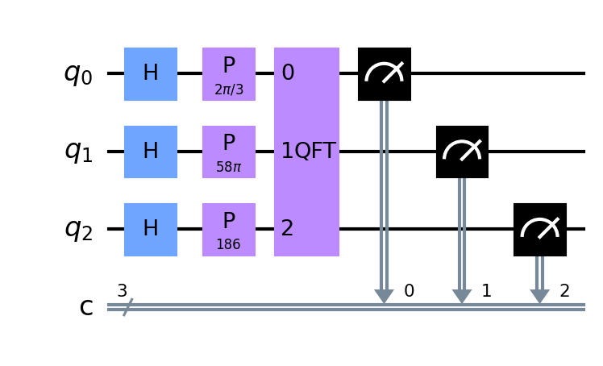

# Shor algorithm - Fast prime factorization

This program is a fast prime factorization program implemented in qiskit.

# Usage

Install requirements and run this program

```bash
pip install -r requirements.txt
python quantium.py
```

Enter the number to be factorized(quantium.py:59)

```python
...

def main():
>>  N = 11 * 17 # to be factorized(인수분해 할 숫자)
    p, q = calculate(N)
    print(N, "=", p, '*', q)
    qc.draw(output="mpl", filename="circuits.png")

...
```

# Circuits


